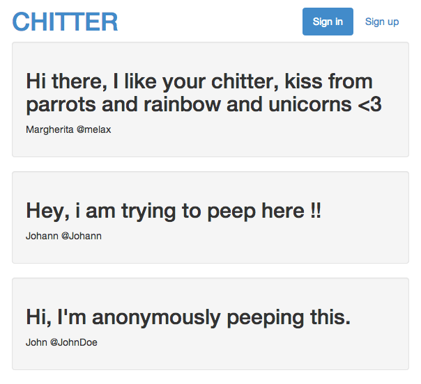

Chitter (a Twitter clone)
=========================

This was the challenge set at the end of Week 6 at Makers Academy.

The objective was to write a mini Twitter clone that would allow users to post messages to a public stream. 

<b>Program Features</b>
- User (aka Maker) can sign up
- User can log in
- User can log out
- Only logged in users can post a tweet (aka peep)
- Peeps can be viewed by all visitors in reverse chronological order

<b>Notes</b>
- Makers sign up with their email, name, username, password and password confirmation
- Usernames and emails are unique
- Peeps have the name of the Maker and their username
- Bcrypt used to secure the passwords
- DataMapper and Postgres used to save data
 


Technologies used
-----------------

- Ruby
- Sinatra
- HTML5
- CSS3 (with Bootstrap)
- PostgreSQL
- Datamapper
- Rspec
- Capybara
- Bcrypt

How to run program
------------------
```sh
git clone https://github.com/juliatan/chitter
cd chitter
shotgun
```

Visit http://localhost:9393 in your browser.

How to run tests
----------------
```sh
cd chitter
rspec
```
